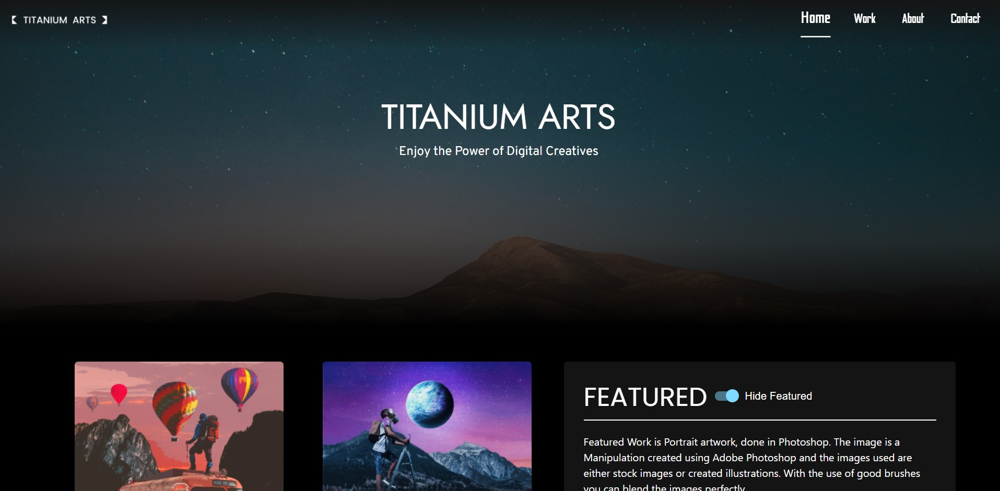

<details open="open">
  <h1>Table of Contents</h1>
  <ol>
    <li>
      <a href="#description">Description</a>
      <ul>
        <li><a href="#built-with">Built With</a></li>
      </ul>
    </li>
    <li>
      <a href="#getting-started">Getting Started</a>
      <ul>
        <li><a href="#prerequisites">Prerequisites</a></li>
        <li><a href="#installation">Installation</a></li>
      </ul>
    </li>
    <li><a href="#contact">Contact</a></li>
  </ol>
</details>

# You can check the site at:

## [Titanium Arts](https://titaniumarts.web.app)

# Project Title

<br/>
<p align="center">
  <a href="https://github.com/RexTitanium/Titanium-Arts.git">
    
  </a>
</p>
<br/>
Titanium Arts

## Description

The site Titanium Arts is a personal project site developed in order to display my Digital Creative Artwork. I needed a platform for both my web dev skills and my art ideas. So with the help of ReactJs I have successfully created so. Firebase helps me collect form data from users who want to connect to me. I intend to halt the development of the site as of now, but would definitely intend to work on this site in the future with much more features.

## Built With

- [ReactJS](https://reactjs.org/)
- [Firebase](https://firebase.google.com/)

## Getting Started

First Clone the repository. Install npm modules and start the application

### Prerequisites:

- Node

### Installation

- Clone the repository
  ```sh
  git clone https://github.com/RexTitanium/Kudos-project.git
  ```
- Install npm packages
  ```sh
  npm install
  ```
- Initialize the site
  ```sh
  npm start
  ```

## Contact

- Email : s4samyak@gmail.com
